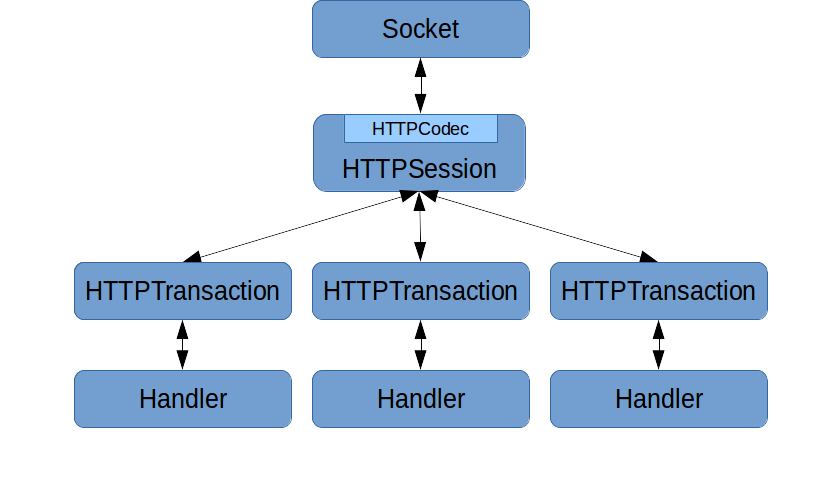

## Coral-Proxygen

Coral-Proxygen is a fork of Proxygen (Facebook's C++ HTTP Libraries).

This project comprises the core C++ HTTP abstractions used at
Facebook. Internally, it is used as the basis for building many HTTP
servers, proxies, and clients. This release focuses on the common HTTP
abstractions and our simple HTTPServer framework. Future releases will
provide simple client APIs as well. The framework supports HTTP/1.1,
SPDY/3, and SPDY/3.1. HTTP/2 support is in progress. The goal is to
provide a simple, performant, and modern C++ HTTP library.

A Google group for general discussions at https://groups.google.com/d/forum/facebook-proxygen.

The [original blog post](https://code.facebook.com/posts/1503205539947302)
also has more background on the project.

### Installing

Coral-Proxygen is built with CMake.

On Debian 8:

First install some dependencies:

- libboost-all-dev (required 1.51.0+)
- libdouble-conversion-dev
- libgflags-dev
- libgoogle-glog-dev
- zlib1g-dev
- libssl-dev
- libcap-dev
- gperf
- coral-folly (https://github.com/Yeolar/coral-folly)
- coral-wangle (https://github.com/Yeolar/coral-wangle)

also install libgtest-dev and google-mock if you want enable test.

Then

```
$ mkdir build && cd build
$ cmake ..
$ make
# make install
```

### Introduction

Directory structure and contents:

| Directory                  | Purpose                                                                       |
|----------------------------|-------------------------------------------------------------------------------|
| `proxygen/external/`       | Contains non-installed 3rd-party code proxygen depends on.                    |
| `proxygen/lib/`            | Core networking abstractions.                                                 |
| `proxygen/lib/http/`       | HTTP specific code.                                                           |
| `proxygen/lib/services/`   | Connection management and server code.                                        |
| `proxygen/lib/ssl/`        | TLS abstractions and OpenSSL wrappers.                                        |
| `proxygen/lib/utils/`      | Miscellaneous helper code.                                                    |
| `proxygen/httpserver/`     | Contains code wrapping `proxygen/lib/` for building simple C++ http servers. We recommend building on top of these APIs. |

### Architecture

The central abstractions to understand in `proxygen/lib` are the session, codec,
transaction, and handler. These are the lowest level abstractions, and we
don't generally recommend building off of these directly.

When bytes are read off the wire, the `HTTPCodec` stored inside
`HTTPSession` parses these into higher level objects and associates with
it a transaction identifier. The codec then calls into `HTTPSession` which
is responsible for maintaining the mapping between transaction identifier
and `HTTPTransaction` objects. Each HTTP request/response pair has a
separate `HTTPTransaction` object. Finally, `HTTPTransaction` forwards the
call to a handler object which implements `HTTPTransaction::Handler`. The
handler is responsible for implementing business logic for the request or
response.

The handler then calls back into the transaction to generate egress
(whether the egress is a request or response). The call flows from the
transaction back to the session, which uses the codec to convert the
higher level semantics of the particular call into the appropriate bytes
to send on the wire.

The same handler and transaction interfaces are used to both create requests
and handle responses. The API is generic enough to allow
both. `HTTPSession` is specialized slightly differently depending on
whether you are using the connection to issue or respond to HTTP
requests.



Moving into higher levels of abstraction, `proxygen/httpserver` has a
simpler set of APIs and is the recommended way to interface with proxygen
when acting as a server if you don't need the full control of the lower
level abstractions.

The basic components here are `HTTPServer`, `RequestHandlerFactory`, and
`RequestHandler`. An `HTTPServer` takes some configuration and is given a
`RequestHandlerFactory`. Once the server is started, the installed
`RequestHandlerFactory` spawns a `RequestHandler` for each HTTP
request. `RequestHandler` is a simple interface users of the library
implement. Subclasses of `RequestHandler` should use the inherited
protected member `ResponseHandler* downstream_` to send the response.

### Using it

Proxygen is a library. After installing it, you can build your own C++
server. Try `cd`ing to the directory containing the echo server at
`proxygen/httpserver/samples/echo/`. You can then build it with this one
liner:

```
g++ -std=c++11 -o my_echo EchoServer.cpp EchoHandler.cpp -lproxygen -lfolly -lwangle -lglog -lgflags -pthread
```

After running `./my_echo`, we can verify it works using curl in a different terminal:

```shell
$ curl -v http://localhost:11000/
*   Trying 127.0.0.1...
* Connected to localhost (127.0.0.1) port 11000 (#0)
> GET / HTTP/1.1
> User-Agent: curl/7.35.0
> Host: localhost:11000
> Accept: */*
>
< HTTP/1.1 200 OK
< Request-Number: 1
< Date: Thu, 30 Oct 2014 17:07:36 GMT
< Connection: keep-alive
< Content-Length: 0
<
* Connection #0 to host localhost left intact
```

### Documentation

We use Doxygen for Proxygen's internal documentation. You can generate a
copy of these docs by running `doxygen Doxyfile` from the project
root. You'll want to look at `html/namespaceproxygen.html` to start. This
will also generate folly documentation.

